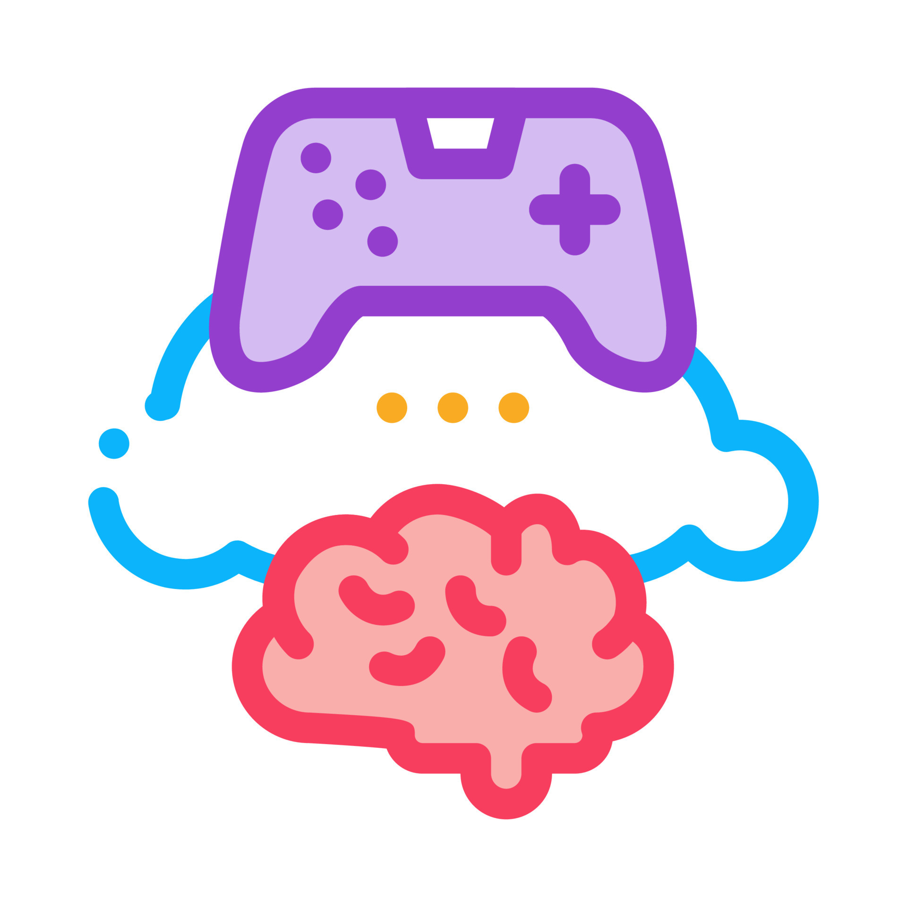

# Brain-Dead App



## Project Overview

Brain-Dead is an interactive puzzle game application featuring 8 unique mini-games, each requiring different interactions with your device. The game challenges players to solve puzzles using various smartphone features including sensors, connectivity, and audio capabilities.

## Game Features

- **User Authentication System**: Register, login, and password recovery functionality
- **Progress Tracking**: Save your game progress across sessions
- **Scoreboard System**: Compare your performance with other players
- **Multiple Game Stages**: 8 unique puzzle games with different mechanics
- **Background Music**: Toggle-able game soundtrack

## Game Stages

1. **Cup Tilt Challenge**: Tilt your phone to pour the water
   - Uses device's accelerometer and magnetometer
   - Hint: Try tilting the phone

2. **Baby Calming Challenge**: Make the crying baby stop crying
   - Find the right toy to calm the baby
   - Interactive drag and drop mechanics

3. **Sleep Inducer**: Help the insomniac fall asleep
   - Uses device's light sensor
   - Hint: Try adjusting the brightness of the phone

4. **WiFi Disconnector**: Solve the network puzzle
   - Interacts with device's network connectivity
   - Hint: Try disconnecting the phone from the network

5. **House Reconstruction**: Rebuild the fragmented house
   - Puzzle assembly with touch controls
   - Hint: Use the glue to stick everything together

6. **Gym Transformation**: Make the fat guy slim
   - Drag and drop interaction puzzle
   - Hint: Look for the vacuum cleaner

7. **Speech Recognition**: Make the old person hear you
   - Uses device's microphone and audio processing
   - Hold the mic button and speak clearly

8. **Final Challenge**: Defeat the monster
   - Final stage combining multiple mechanics

## Technical Implementation

- **Built with**: Java on Android
- **Database**: SQLite for user data and game progress
- **Animations**: Lottie animations for visual feedback
- **Sensors used**:
  - Accelerometer and Magnetic Field (Game 1)
  - Light Sensor (Game 3)
  - Network Connectivity (Game 4)
  - Audio Recording (Game 7)

## Setup Instructions

### Prerequisites
- Android Studio
- Android SDK with minimum API level 33
- Java 8 or later

### Installation
1. Clone the repository
   ```
   git clone https://github.com/yourusername/Brain-Dead-App.git
   ```
2. Open the project in Android Studio
3. Sync Gradle dependencies
4. Build and run on an emulator or physical device

## Permissions Required
- Light sensor
- Accelerometer
- Compass
- Gyroscope
- Network access
- Audio recording

## Code Structure

- **Authentication**: [`LoginPage`](app/src/main/java/com/example/LoginPage.java), [`SignupPage`](app/src/main/java/com/example/SignupPage.java), [`ResetPage`](app/src/main/java/com/example/ResetPage.java)
- **Game Stages**: [`Game1`](app/src/main/java/com/example/Game1.java) through [`Game8`](app/src/main/java/com/example/Game8.java)
- **Database Management**: [`DatabaseHelper`](app/src/main/java/com/example/DatabaseHelper.java)
- **Statistics**: [`ScoreboardPage`](app/src/main/java/com/example/ScoreboardPage.java)
- **Audio**: [`BackgroundMusic`](app/src/main/java/com/example/BackgroundMusic.java)

## Testing

The game has been tested on various Android devices to ensure compatibility across different screen sizes and hardware capabilities.

## Contributing

Contributions to improve the game are welcome. Please feel free to submit a Pull Request.

## License

This project is licensed under the [LICENSE NAME] - see the LICENSE file for details.